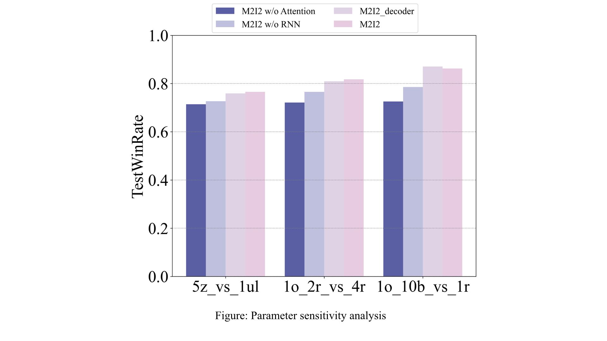
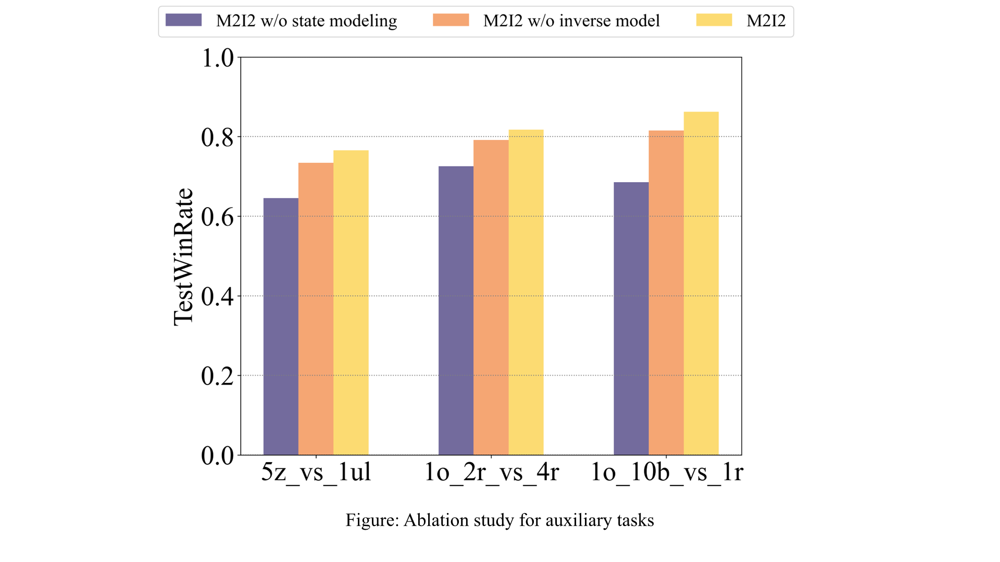

# rebuttal_ICML_reviewer_y28Y

|Converge step|M2I2|M2I2 w/o inverse model|M2I2 w/o state modeling|M2I2 w/o DRN|
|-|-|-|-|-|
|hallway|600K±100K|800K±140K|1600K+|950K±200K|
|hallway_group|300K+-120K|600K±180K|2000K+|1000K±300K|

